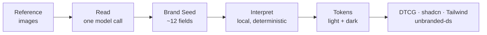

# Cambium

Turn a reference image into an accessible, semantic design token set that explains every choice.

> [!NOTE]
> **Status: specified, not yet built.** The design is settled and sliced into work. There is no application code in this repo yet. [Issue #1](https://github.com/kendrick/cambium/issues/1) holds the full spec; 32 tickets hang off it. Start at [#2](https://github.com/kendrick/cambium/issues/2), the only one with no blockers.

## The Problem

Standing up the token layer of a design system takes a day, and most of that day is guesswork.

You have a brand. A logo, a moodboard, a photograph of packaging, an album cover, a screenshot. What you need is a semantic token set: a primary, surfaces, borders, a radius scale, a type scale, a neutral ramp, status colors, all of it working in light and dark.

Tools that exist give you a palette dump. Here are the twelve most common colors in your image. That isn't a design system. It has no neutral ramp, no destructive color, no hover state, no dark mode, and no idea whether any two of its colors pass contrast. Turning that dump into something a team can build against is the actual work.

And when you do it by hand, the reasoning evaporates. Six months later the file says `border: oklch(0.89 0.01 265)` and nobody remembers why.

## What Cambium Does

It reads your image as **inspiration, not inventory**. Rather than recovering the exact colors you uploaded, it uses them to seed a system that is internally consistent, accessible in both color schemes, and complete enough to build on.

Most screenshots contain no destructive color, no full neutral ramp, and no popover surface. Cambium invents those deliberately, then tells you it did.

Everything to the right of the Brand Seed is OKLCH math running in your browser. It needs no network call and costs nothing, which is what makes the rest work:

- Interpretation presets are live. Switching between Faithful, Balanced, and Expressive re-derives the whole system in a frame.
- Dark mode is free. Both palettes come from one seed, generated independently against the same step roles rather than inverted from each other.
- Results are reproducible. The same seed always produces the same tokens.
- A failed model call can't lose work. Generation produces a new immutable version, so failure just means no new version appeared.

The seed is about a dozen fields, which is small enough to show you all of it. So there's no evidence pane showing a sample of what the model saw. The seed is the thing you edit: change any field, pin the values you care about, and everything downstream re-derives.

Every token carries its provenance—`observed` from your image, `derived` by the pipeline, or `invented` to fill a gap—plus a one-line reason. That travels in the exported file's `$extensions`, so the reasoning outlives the tool that produced it.

## Design Constraints

These are settled, and they shape most of the decisions above.

| | |
|---|---|
| **No server** | Static export. No route handlers, no server actions, no middleware. |
| **Your key, your browser** | You supply the API key. It is held for the session and never leaves the page. |
| **Works without a key** | A keyless path extracts colors locally, and canned records demo the rest. |
| **DTCG first** | [W3C Design Tokens 2025.10](https://tr.designtokens.org/format/) is the canonical output. Everything else is an adapter. |
| **No client material** | Test and demo data are public brands and generic imagery. |

Planned stack: Next.js App Router, TypeScript, Tailwind v4, shadcn/ui.

## What's Here

Until the scaffold lands, this repo is documentation and a work graph.

| Path | What it holds |
|---|---|
| [`docs/research/oss-landscape.md`](docs/research/oss-landscape.md) | Which libraries to use for color math, contrast, and DTCG, and which to avoid. Sizes measured locally, every claim cited. |
| [`docs/agents/`](docs/agents/) | Conventions for agents working in this repo: issue tracker, triage labels, domain docs. |
| [`AGENTS.md`](AGENTS.md) | Entry point for coding agents. `CLAUDE.md` imports it. |
| [Issue #1](https://github.com/kendrick/cambium/issues/1) | The spec. Problem, solution, 76 user stories, implementation and testing decisions. |

## Development

There's nothing to run yet. [Ticket #2](https://github.com/kendrick/cambium/issues/2) establishes the build, the test runner, and the static-export configuration, and every other ticket waits on it.

Build order is deliberate. The color pipeline gets built and evaluated headless, behind a CLI, before any interface exists. Generating a twelve-step scale that lands on its contrast targets is the part that can fail on quality rather than plumbing, and finding that out on day one beats finding it out after a week of UI work.

## Contributing

This is a personal project, so there's no contribution process to speak of. Issues and observations are welcome anyway.

## License

[MIT](LICENSE)

Brand names and any reference images used in demos belong to their owners. Cambium is not affiliated with them.
